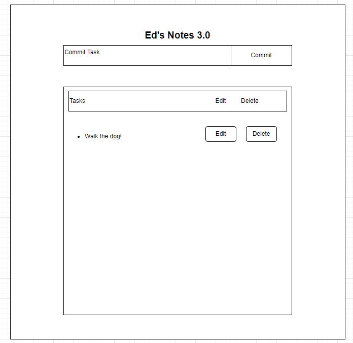

# Ed's Notes 3.0

Ed's Notes 3.0  is a website designed to keep me, Edwin William, organized and accountable.

As someone who is always on the move, I needed somehwere to track my activities, appointments, commitments. Example:
* Family commitments
* Work commitments
* Personal commitments

Wireframe:
Method  |   Path    |   Purpose
--------------------------------
Get     |   /           | login page
Post    |   /tasks      | create a new task
Get     |   /tasks/:id  | specific task
Put     |   /task/:id   | update task
Delete  |   /task/:id   | delete task   

 

Database:

Users:
Name    |   Data-type   |   Prop
------------- | ------------- |------------
users_id    |   Interger |   primary key
name    |   TEXT    |   NOT NULL
email   |   VARCHAR |   NOT NULL

Tasks:
Name    |   Data-type   |   Prop
------------- | ------------- |------------
tasks_id    |   Interger |   primary key
description   |   VARCHAR    |   NOT NULL
